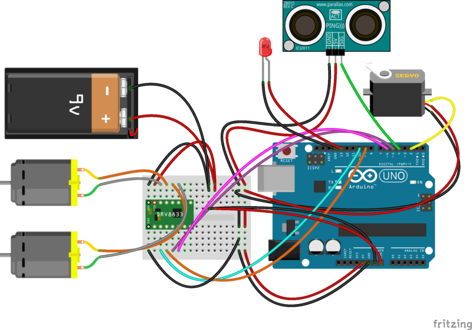

# Robobo.

Robobo is a poor stupid bot that only avoids crashing against walls (or cats)
by turning right before reaching an obstacle.

This is a work in progress.

## Parts

* [Dagu Rover 5 chassis](http://www.robotshop.com/en/dagu-rover-5-4wd-tracked-chassis.html)
* [DRV8835 motor controller](http://www.pololu.com/product/2135)
* [Arduino UNO](http://arduino.cc/en/Main/arduinoBoardUno)
* [Parallax PING))) Sensor](http://www.pololu.com/product/1605)
* [Parallax Standard Servo](http://www.parallax.com/product/900-00005)

## Software

* [motor_driver.h](https://github.com/xiam/arduino_drv8833)
* [ping.h](https://github.com/xiam/arduino_ping)

## Diagrams

## License

> Copyright (c) 2014 José Carlos Nieto, https://menteslibres.net/xiam
>
> Permission is hereby granted, free of charge, to any person obtaining
> a copy of this software and associated documentation files (the
> "Software"), to deal in the Software without restriction, including
> without limitation the rights to use, copy, modify, merge, publish,
> distribute, sublicense, and/or sell copies of the Software, and to
> permit persons to whom the Software is furnished to do so, subject to
> the following conditions:
>
> The above copyright notice and this permission notice shall be
> included in all copies or substantial portions of the Software.
>
> THE SOFTWARE IS PROVIDED "AS IS", WITHOUT WARRANTY OF ANY KIND,
> EXPRESS OR IMPLIED, INCLUDING BUT NOT LIMITED TO THE WARRANTIES OF
> MERCHANTABILITY, FITNESS FOR A PARTICULAR PURPOSE AND
> NONINFRINGEMENT. IN NO EVENT SHALL THE AUTHORS OR COPYRIGHT HOLDERS BE
> LIABLE FOR ANY CLAIM, DAMAGES OR OTHER LIABILITY, WHETHER IN AN ACTION
> OF CONTRACT, TORT OR OTHERWISE, ARISING FROM, OUT OF OR IN CONNECTION
> WITH THE SOFTWARE OR THE USE OR OTHER DEALINGS IN THE SOFTWARE.
